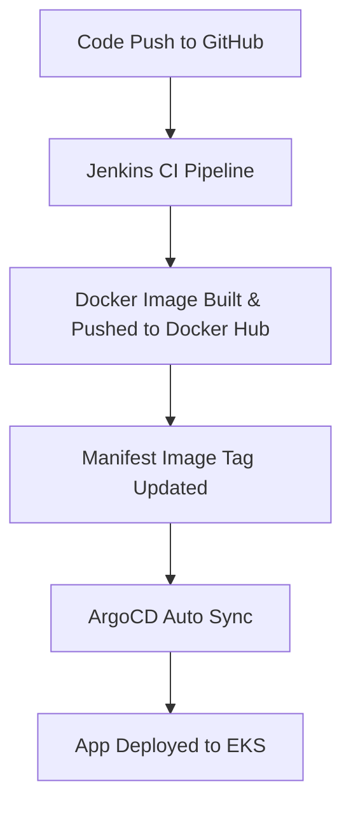

# 🚀 GitOps CI/CD Pipeline on AWS EKS using Jenkins + ArgoCD

Welcome to a real-world **GitOps-driven CI/CD pipeline** project, combining the power of **Jenkins**, **ArgoCD**, **Docker**, **Helm**, **Kustomize**, and **AWS EKS** — provisioned entirely with **Terraform**.

This project is part of my **Real-Life DevOps Portfolio Journey** under the **TECIE-DESK Support Solution** brand, designed to showcase industry-standard DevOps practices with modern tooling.

---

## 📸 Project Overview

Over the course of this project, I:

- ✅ Provisioned **AWS EKS** clusters using Terraform
- 🐳 Containerized microservices with Docker
- 🔧 Set up CI pipelines in **Jenkins** to build/test Docker images
- 📦 Pushed images to **Docker Hub**
- 🌿 Leveraged **ArgoCD** to continuously sync and deploy to Kubernetes via GitOps
- 🛠️ Deployed apps using **Helm** and **Kustomize**
- 🔐 Managed service isolation and deployment via Kubernetes **namespaces**

---

## 🧰 Tech Stack

| Tool | Purpose |
|------|---------|
| **Terraform** | Infrastructure provisioning (EKS, VPC, IAM, etc.) |
| **Jenkins** | Continuous Integration (CI) |
| **ArgoCD** | Continuous Delivery (CD) using GitOps |
| **Docker** | App containerization |
| **Kubernetes (EKS)** | Orchestration platform |
| **Helm** | App templating & packaging |
| **Kustomize** | Kubernetes manifest customization |
| **GitHub** | Source Control and GitOps integration |

---

## 🔁 GitOps Workflow (High-Level)



---

## 📂 Repository Structure

```bash
├── Jenkinsfile                      # Jenkins CI pipeline definition
├── Dockerfile                       # Base image for app container
├── manifests/
│   ├── kustomize-app/               # Kustomize deployment
│   ├── helm-app/                    # Helm chart deployment
│   ├── microservices-app/           # Multi-container setup
│   └── nginx-app/                   # Basic NGINX K8s deployment
├── argocd/
│   ├── helm-app.yaml
│   ├── kustomize-app.yaml
│   ├── microservices-app.yaml
│   └── nginx-app.yaml
├── terraform/
│   ├── main.tf                      # EKS + VPC + IAM configuration
│   ├── variables.tf
│   ├── outputs.tf
│   └── provider.tf
└── README.md
```

---

## 🔧 Setup & Deployment Guide

### 1. Clone Repository
```bash
git clone https://github.com/teciedesk/kubernetes-gitops-argocd.git
cd kubernetes-gitops-argocd
```

### 2. Provision AWS Infrastructure via Terraform
```bash
cd terraform/
terraform init
terraform apply -auto-approve
```

### 3. Configure kubectl with EKS Cluster
```bash
aws eks --region us-east-1 update-kubeconfig --name <cluster_name>
```

### 4. Install ArgoCD on EKS
```bash
kubectl create namespace argocd
kubectl apply -n argocd -f https://raw.githubusercontent.com/argoproj/argo-cd/stable/manifests/install.yaml
```

### 5. Access ArgoCD UI
```bash
kubectl port-forward svc/argocd-server -n argocd 8080:443
```
Login with:
```bash
Username: admin
Password: <ARGOCD INITIAL PASSWORD>
```

### 6. Install & Access Jenkins
```bash
docker run -d -p 8080:8080 -p 50000:50000 --name jenkins -v jenkins_home:/var/jenkins_home jenkins/jenkins:lts
```

### 7. Set Up Jenkins Pipeline
- Add GitHub credentials and Docker Hub credentials
- Use `Jenkinsfile` from this repo as a pipeline definition

---

## 📈 Monitoring & Management

ArgoCD Applications configured:

| App Name           | Tool       | Namespace        |
|--------------------|------------|------------------|
| `helm-app`         | Helm       | `apps`           |
| `kustomize-app`    | Kustomize  | `kustomize`      |
| `nginx-app`        | YAML       | `nginx`          |
| `monitoring-app`   | Helm       | `monitoring`     |
| `microservices-app`| Multi-tier | `microservices`  |

All apps are:
✅ Synced  
✅ Healthy  
✅ Automated by ArgoCD GitOps

---

## 🖥️ Demo Screenshots


---

## 💼 About the Author

**Tobiliba | TECIE-DESK Support Solution**  
🔗 [LinkedIn](https://linkedin.com/in/tobiliba)  
📦 [Docker Hub](https://hub.docker.com/u/tobiliba993)  
🌐 [GitHub](https://github.com/teciedesk)

---

## 📃 License

[MIT License](./LICENSE)

---

## 📣 Want to Learn More?

👉 Check out the LinkedIn Post: [🔗 View Project Showcase](https://www.linkedin.com/feed/update/urn:li:activity:1234567890123456789)

Use this as a blueprint to build your own GitOps CI/CD automation! 🛠️
